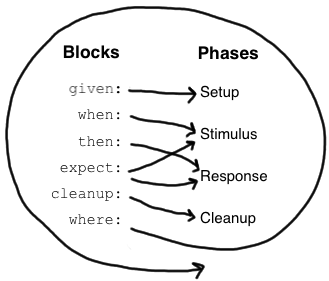

# spock

<div align="center">
  <a href="https://github.com/zen-xu/spock/actions">
    
  </a>
  <a href="https://codecov.io/gh/zen-xu/spock">
    
  </a>
  <a href="https://pypi.org/project/pyspock">
    
  </a>
  
  <a href="https://github.com/zen-xu/spock/blob/main/LICENSE">
    
  </a>
</div>
<div align="center">
  <a href="https://results.pre-commit.ci/latest/github/zen-xu/spock/main">
    
  </a>
  <a href="https://github.com/psf/black">
    
  </a>
  <a href="https://deepsource.io/gh/zen-xu/spock/?ref=repository-badge}" target="_blank">
    
  </a>
</div>

`pyspock` is a BDD-style developer testing and specification framework for Python, and this is an implementation of the [`spock`](https://github.com/spockframework/spock).

An example of simple test:

```python
import pytest


@pytest.mark.spock("maximum of {a} and {b} is {c}")
def test_maximum():
    def expect(a, b, c):
        assert max(a, b) == c

    def where(_, a, b, c):
        _ | a | b | c
        _ | 3 | 7 | 7
        _ | 5 | 4 | 5
        _ | 9 | 9 | 9
```

If you are using vscode, you can find there will be 3 test cases.


## Installation

```bash
pip install pyspock
```

Note the minimum version of pytest is 6.2.4.

## Mark

It is easy to define spock test cases, just use `pytest.mark.spock` to decorate your test function.

```python
@pytest.mark.spock
def test_bigger():
    def expect():
        assert 2 > 1
```

spock mark also accepts one parameter, which is used to render identity for each iteration arguments.

```python
@pytest.mark.spock("{a} > {b}")
def test_bigger():
    def expect(a, b):
        assert a > b

    def where(_, a, b):
        _ | a | b
        _ | 7 | 3
        _ | 5 | 2
```

## Blocks

There are six kinds of blocks: `given`, `when`, `then`, `expect`, `cleanup` and `where` blocks. Each block is a function defined by its name.

A test function must have at least one explicit block. Blocks divide a test function into distinct sections, and cannot be nested.



The above picture shows how blocks map to the conceptual phases of a feature function. The where block has a special role, which will be revealed shortly. But first, let’s have a closer look at the other blocks.


### 1. Given block

```python
@pytest.mark.spock
def test_demo():
    def given(me):
        me.stack = []
        me.elem = 1
```

The `given` block is where you do any setup work for the feature that you are describing. It may not be preceded by other blocks. A `given` block doesn’t have any special semantic, and it is optional and may be omitted.

The `given` accepts all pytest fixtures, besides it has a special fixture named `me`, which can take any setup values. Those setup values can be as fixtures in other blocks except the `where` block.

### 2. When and Then blocks

```python
@pytest.mark.spock
def test_append_element():
    def given(me):
        me.stack = []
        me.elem = 1

    def when(stack, elem):
        # stimulus
        stack.append(elem)

    def then(stack, elem):
        # response
        assert len(stack) == 1
        assert stack.pop() == elem
```

The `when` and `then` blocks always occur together. They describe a stimulus and the expected response. Whereas when blocks may contain arbitrary code, then blocks are restricted to conditions, exception conditions, interactions.

The `then` has a special fixture named `excinfo`, which represents whether the `when` block raises exception. If the `when` block not raises exception, then `excinfo` will be None. The `excinfo` type is [ExceptionInfo](https://docs.pytest.org/en/stable/reference.html#exceptioninfo).


```python
@pytest.mark.spock
def test_zero_division():
    def when():
        1 / 0

    def then(excinfo):
        assert excinfo.type is ZeroDivisionError
```

### 3. Expect block

An `expect` block is more limited than a `then` block in that it may only contain conditions and variable definitions. It is useful in situations where it is more natural to describe stimulus and expected response in a single expression. For example, compare the following two attempts to describe the `max` function:

```python
@pytest.mark.spock
def test_maximum():
    def given(me):
        me.x = max(1, 2)

    def then(x):
        assert x == 2
```

equals to:

```python
@pytest.mark.spock
def test_maximum():
    def expect():
        assert max(1, 2) == 2
```

### 4. Cleanup block

```python
@pytest.mark.spock
def test_file():
    def given(me):
        me.file = open("test.txt", "r+")

    def when(file):
        file.write("hello")

    def then(file):
        file.seek(0)
        assert file.read() == "hello"

    def cleanup(file):
        file.close()
```

 `cleanup` block is used to free any resources used by a test case, and will run even if (a previous part of) the test case has produced an exception. As a consequence, a `cleanup` block must be coded defensively.

### 5. Where block

A `where` block always comes last in a test function. It is used to write data-driven feature functions. To give you an idea how this is done, have a look at the following example:

```python
@pytest.mark.spock("max({a}, {b}) == {c}")
def test_maximum_of_two_numbers():
    def expect(a, b, c):
        assert max(a, b) == c

    def where(a, b, c):
        a << [5, 3]
        b << [1, 9]
        c << [5, 9]
```

This `where` block effectively creates two "versions" of the feature functions: One where a is 5, b is 1, and c is 5, and another one where a is 3, b is 9, and c is 9.

Although it is declared last, the where block is evaluated before the feature function containing it runs.

#### Data table

`where` block support another syntax to specify the data.

```python
@pytest.mark.spock("max({a}, {b}) == {c}")
def test_maximum_of_two_numbers():
    def expect(a, b, c):
        assert max(a, b) == c

    def where(_, a, b, c):
        _ | a | b | c
        _ | 5 | 1 | 5
        _ | 3 | 9 | 9
```

The first line of the table, called the table header, declares the data variables. The subsequent lines, called table rows, hold the corresponding values. For each row, the feature method will get executed once; we call this an iteration of the function. If an iteration fails, the remaining iterations will nevertheless be executed. All failures will be reported.

You can also split the data table into multiple parts.

```python
@pytest.mark.spock("max({a}, {b}) == {c}")
def test_maximum_of_two_numbers():
    def expect(a, b, c):
        assert max(a, b) == c

    def where(_, a, b, c):
        _ | a | b
        _ | 5 | 1
        _ | 3 | 9

        _ | c
        _ | 5
        _ | 9
```

#### Accessing other data variables

```python
def where(_, a, b):
    _ | a | b
    _ | 5 | a + 1
    _ | 3 | a + 2
```

variable supports all operators like `+`, `-`, `*`, `/`, `%`, `**`, `//`, `==`, `!=`, `<`, `<=`, `>`, `>=` and so on.

#### adapter black

if you are using `black`, you should close fmt when use data table.

```python
def where(_, a, b, c):
    # fmt: off
    _ | a | b     | c
    _ | 5 | a + 1 | 4
    _ | 3 | a + 2 | 2
    # fmt: on
```

### 6. Conclusion

| block       | Support fixtures | Special fixtures | Optional                   |
| ----------- | ---------------- | ---------------- | -------------------------- |
| **given**   | ✅                | `me`             | ✅                          |
| **when**    | ✅                | ❎                | ✅                          |
| **then**    | ✅                | `excinfo`        | when `expect` block exists |
| **expect**  | ❎                | ❎                | when `then` block exists   |
| **cleanup** | ✅                | ❎                | ✅                          |
| **where**   | ✅                | `_`              | ✅                          |
